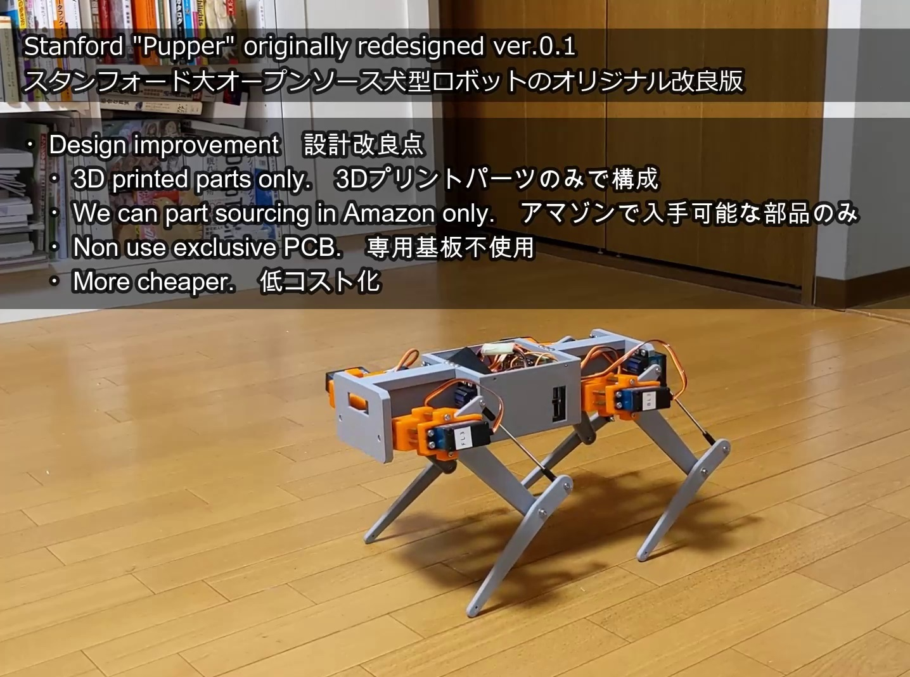
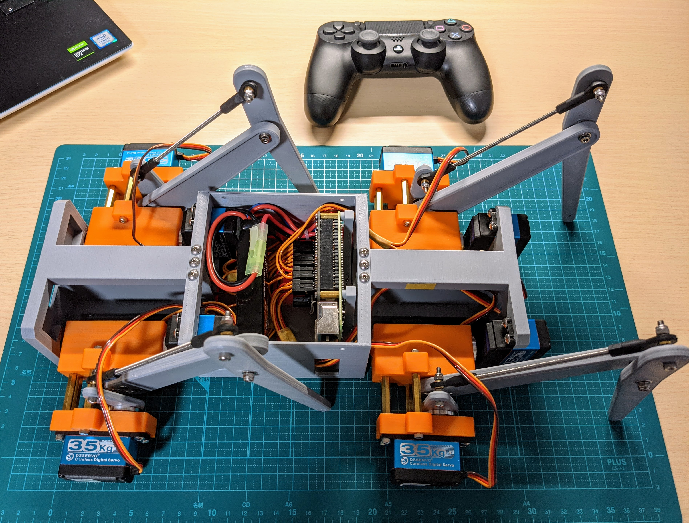
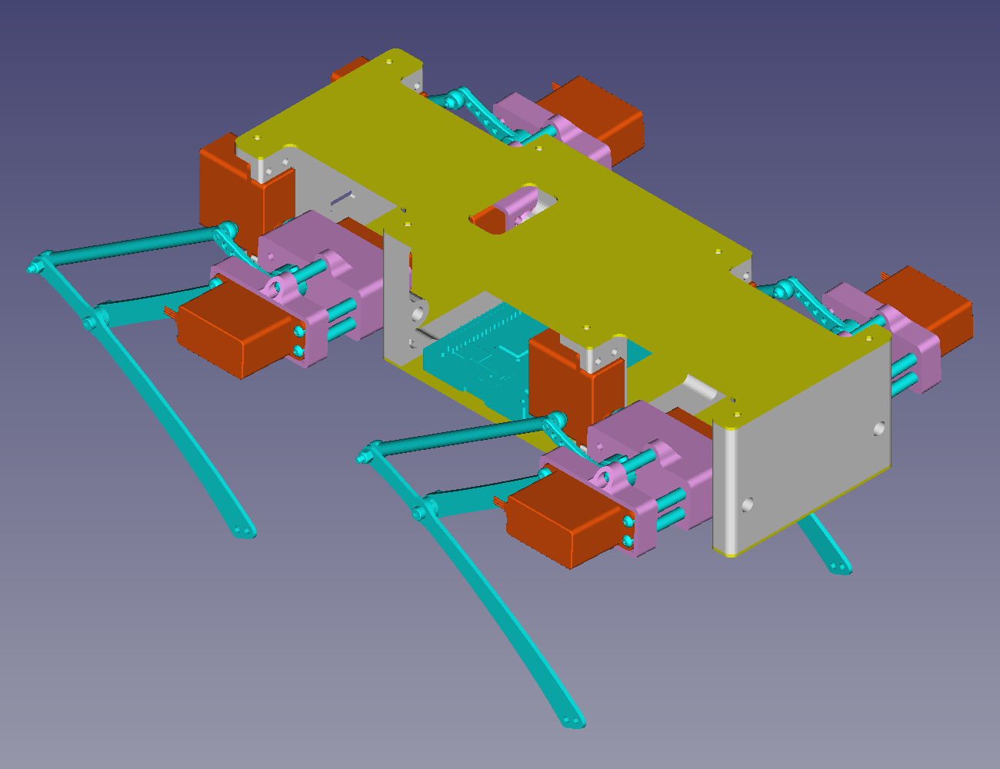
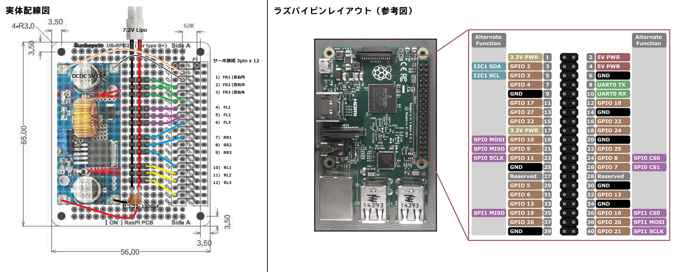
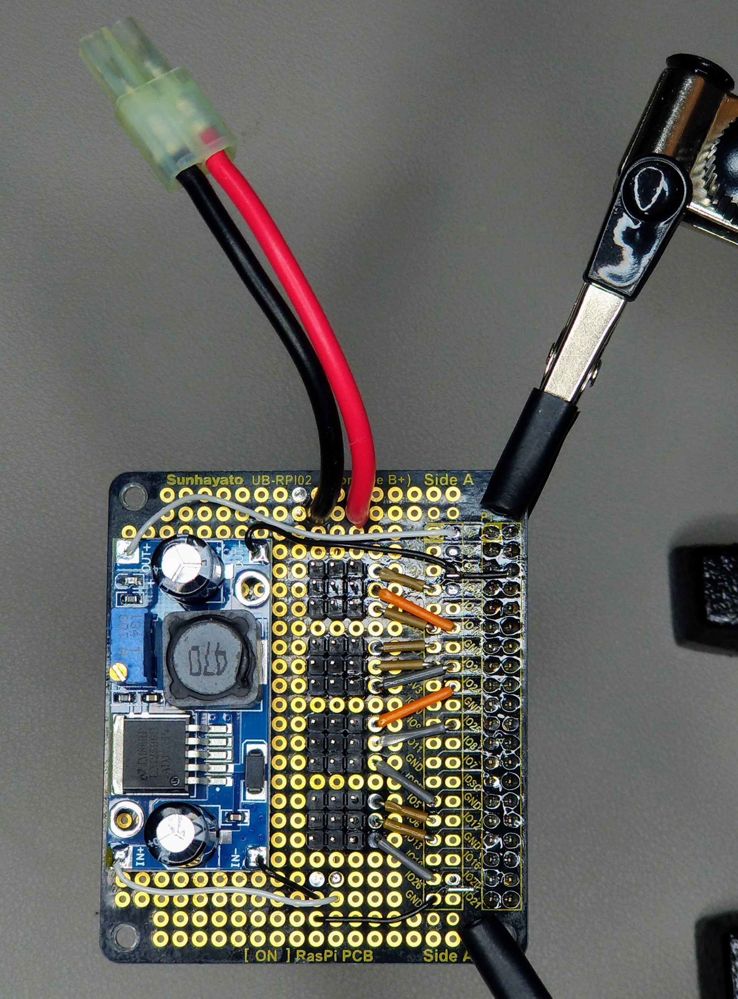
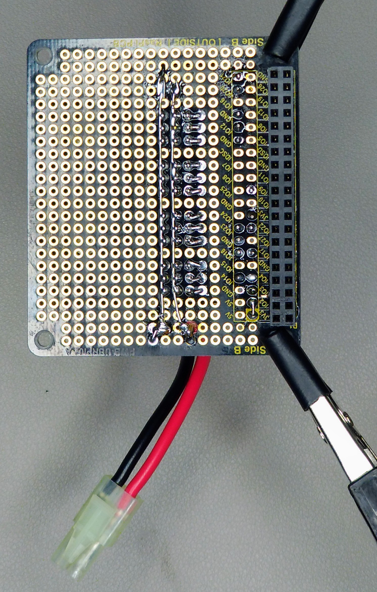

# INNURobo_redesigned_StanfordQuadruped
"INNURobo" is redesigned  StanfordQuadruped "Pupper" to easily and cheap buide.  
  
・Design improvement　設計改良点  
・3D printed parts only.　3Dプリントパーツのみで構成  
・We can part sourcing in Amazon only.　アマゾンで入手可能な部品のみ  
・Non use exclusive PCB.　専用基板不使用  
・Non use CFRP cutting plate. CFRP板カット品不要  
・More cheaper.　低コスト化  
  
Stanford Pupper  https://stanfordstudentrobotics.org/pupper  
https://github.com/stanfordroboticsclub/StanfordQuadruped

Design on FreeCAD  

  
Stanford Pupper original  

  
PCB circuit  

  
